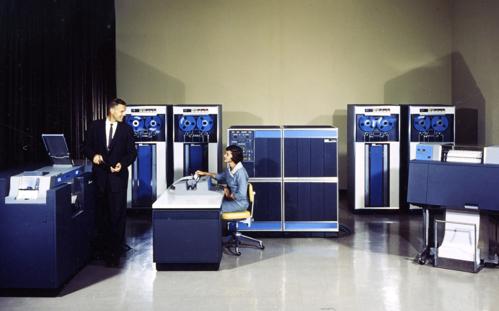

## 4. Namnkonventioner

Om inget annat sägs eller andra teamöverenskommelser finns, följ Microsofts namngivning, dokumentation och guider. Harmonisera med .NET ramverket. För att backa upp det, och vara ännu mera precis, använd [StyleCop](https://github.com/StyleCop/StyleCop) som vägledning. 

1. Använd engelska  
Alla medlemmar, parametrar och variabler bör namnges med ord från engelska språket.  

1. Domänspråk är undantag till engelska  
Använd ord, fraser och termer från företagets domän eller vad som är allmänt vedertaget i branschen. Finns det en entitet som heter `Konto` som kommer från ett backofficesystem, behåll det. Döp det inte till `Account`. Det underlättar när ytterligare en kontohanterare implementeras där namngivningen av objekt faktiskt är `Account`. Om det finns en framtagen domänspråksdokumentation i företaget, följ den framför allt annat.

    Gemensamt domänspråk är viktigt i kedjor som: `beslutsfattare/intressent ↔ affärsanalytiker ↔ produktägare ↔ arkitekt ↔ projektledare ↔ scrummaster ↔ interaktionsdesigner ↔ copywriter ↔ redaktör ↔ kundtjänst ↔ ekonomichef ↔ kientutvecklare ↔ backendutvecklare ↔ api-utvecklare`. 

    Det är oundvikligt att begrepp tas bort eller ändrar betydelse i delar av systemkedjan. Då är kommentarer i kod att rekommendera. Beskriv vad det hette tidigare och möjligen lite bakgrund, då blir det enkelt att söka/hitta och förstå koden.

    * [Ubiquitous Language](https://martinfowler.com/bliki/UbiquitousLanguage.html)
    * [Ubiquitous language without domain-driven design](https://mikealdo.github.io/2016/04/15/Ubiquitous-language-without-domain-driven-design.html)

1. Grammatiskt rätt  
Välj namn som är lätta att läsa och grammatiskt korrekt. Föredra exempelvis `HorizontalAlignment` framför `AlignmentHorizontal`.

1. Använd inte ord från programmeringsspråk  
Undvik att använda nyckelord från språk i lösningen. Använd exempelvis inte `Interface` som en variabel.

1. Använd inte prefix för fält  
Några exempel:
    * Använd inte `_` som prefix för privata fält. 
    * Använd inte `g_` eller `s_` för att skilja på statiska och icke statiska fält.
    * Använd inte typnamn (eller förkortning av det) som prefix, exempelvis `strAge`.

1. Undvik förkortningar  
Exempel: använd `OnButtonClick` framför `OnBtnClick`. Undvik också variabler med enskilda tecken som i och q. Använd `index` respektive `query` istället. Undantaget till regeln kan vara välkända förkortningar som är allmänt accepterade eller välkända i domänen. `UI` framför `UserInterface` är ett exempel.

1. Ange inte typer i namn  
Namnge medlemmar, parametrar eller variabler efter dess betydelse och inte efter vilken typ det är. Exempel: `GetLength` är ett bättre namn än `GetInt`. Använd inte `Enum`, `Class` eller `Struct` i namn.

1. Upprepa inte klassnamn i medlemmar  

    &#x274C; UNDVIK:
    ```csharp
    class Employee
    {
        Employee GetEmployee() {}
        DeleteEmployee() {}
    }
    ```
    &#x2705; GÖR SÅ HÄR:
    ```csharp
    class Employee
    {
        Employee Get() {}
        Delete() {}
    }
    ```
    
1. Klasser som singular   
Namnge klasser som singular för att undvika förrvirring när man skapar kollektioner. Om man du inte kan ta bort "s" från ett klassnamn kan du lägga till ord som "Model", "Type" eller andra generella namn. Dvs CategoriesModel.   

    &#x274C; UNDVIK:
    ```csharp
    var categories = new List<Categories>();
    ```
    &#x2705; GÖR SÅ HÄR:
    ```csharp
    var categories = new List<Category>();
    ```

1. Namnge som i .NET Framework  
Namnge medlemmar på liknande sätt som medlemmar i .NET Framework-klasser. Om du exempelvis definierar en klass som ska bete sig som en samling, lägg till medlemmar som `Add`, `Remove` och `Count` framför `AddItem`, `Delete` eller `NumberOfItems`.

1. Egenskapsnamn  
    * Namnge egenskaper med substantiv, substantivfraser eller ibland adjektiva fraser. 
    * Benämn booleska egenskaper med jakande fraser, exempelvis `CanSearch` istället för `CantSearch`.
    * Använd prefix som `Is`, `Has`, `Can` och `Allows` för booleska egenskaper. Exempel: `IsVisible`, `HasChildren` och `CanExecute`.

1. Metodnamn  
Namnge metoder med verb eller verb-objekt par. Exempel `Show` respektive `ShowDialog`. Ett bra namn bör ge en antydan om **vad** en medlem gör, och om möjligt, **varför**.

    Inkludera inte `And` i namnet på en metod. Det innebär att metoden gör mer än en sak och det bryter mot "single responsibility principle”.

    En generell konvention för metoder som returnerar `Task` eller `Task<Result>` är att namnge dem med suffixet `Async` alternativt `TaskAsync`. 

1. Namnge namnrymder  
Använd produktnamn, teknikbenämningar, lager, verb och funktioner i namnrymder. Överväg att använda företagsnamn då uppköp och fusioner händer. 

    Undvik namn på typer i namnrymder, exempelvis en klass med namnet `Order`. Men ett substantiv i pluralform är vanligt, såsom `Collections` och `Helpers`.

1. Händelsenamn  
Namnge händelser med verb eller verbfraser. Till exempel: `Click`, `Deleted`, `Closing`, `Minimizing` och `Arriving`. Använd `-ing` och `-ed` för att uttrycka före och efter en händelse.

    Anta att du vill definiera händelser relaterade till radering av ett objekt. Undvik att definiera `Deleting` och `Deleted` som `StartDelete` och `EndDelete`. Namnge istället dessa som:
    * `Deleting`: Händer straxt före objektet blir raderat.
    * `Delete`: Händer när objektet behöver raderas av händelsehanteraren.
    * `Deleted`: Händer när objektet redan är raderat.

    Det är god praxis att ha `On` som prefix i metoder som handskas med händelser. Till exempel kan en metod som hanterar `Closing` namnges som `OnClosing`.

1. Pascal- eller Camel format  
    Namnge typer enligt nedan.

    | Språkelement                                    | Format                        | Exempel | StyleCop-regler |
    |-------------------------                        |------------                   |--------------------|--------------------------------------------------------------------------------|
    | Class, Struct | Pascal | `AppDomain` |  |
    | Interface | Pascal | `IBusinessService` | [SA1302: InterfaceNamesMustBeginWithI](http://stylecop.soyuz5.com/SA1302.html) |
    | Enumeration type | Pascal | `ErrorLevel` |  |
    | Enumeration values | Pascal | `FatalError` |  |
    | Event | Pascal | `Click` |  |
    | Private field | Camel | `listItem` | [SA1306: FieldNamesMustBeginWithLowerCaseLetter](http://stylecop.soyuz5.com/SA1306.html)<br>[SA1310: FieldNamesMustNotContainUnderscore](http://stylecop.soyuz5.com/SA1310.html)<br>[SA1309: FieldNamesMustNotBeginWithUnderscore](http://stylecop.soyuz5.com/SA1309.html)<br>[SA1305: FieldNamesMustNotUseHungarianNotation](http://stylecop.soyuz5.com/SA1305.html) |
    | Protected field | Pascal | `MainPanel` | [SA1307: AccessibleFieldsMustBeginWithUpperCaseLetter](http://stylecop.soyuz5.com/SA1307.html) |
    | Constant field | Pascal | `MaximumItems` | [SA1303: ConstFieldNamesMustBeginWithUpperCaseLetter](http://stylecop.soyuz5.com/SA1303.html) |
    | Constant Local variable | Camel | `maximumItems` |  |
    | Read-only static field | Pascal | `RedValue` | [SA1304: NonPrivateReadonlyFieldsMustBeginWithUpperCaseLetter](http://stylecop.soyuz5.com/SA1304.html) |
    | Local Variable | Camel | `listOfValues` | [SA1308: VariableNamesMustNotBePrefixed](http://stylecop.soyuz5.com/SA1308.html) |
    | Method | Pascal | `ToString` |  |
    | Namespace | Pascal | `System.Drawing` |  |
    | Parameter | Camel | `typeName` |  |
    | Type Parameter | Pascal | `TView` |  |
    | Property | Pascal | `BackColor` |  |

    I ReSharper kan det vara definerat på detta sätt som standrad:  
    

Referenser:
* [Naming Guidelines](http://www.dofactory.com/reference/csharp-coding-standards)
* [C# Coding Standards and Naming Conventions](http://www.dofactory.com/reference/csharp-coding-standards)
* [StyleCop - Wikipedia](https://en.wikipedia.org/wiki/StyleCop)


***
<span style="float:left">&#x25C0; <a href="03-Drivande_principer.md">Drivande principer</a></span>  |  <span style="float:right"><a href="05-Layoutkonventioner.md">Layoutkonventioner</a> &#x25B6;</span>
